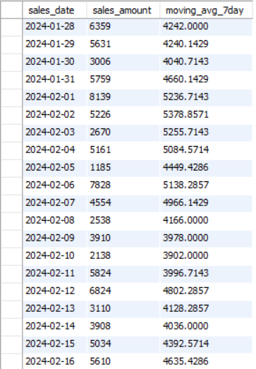

# Retail Sales SQL Analysis

## 📌 Project Overview
This project analyzes retail sales data using SQL to extract business insights and demonstrate analytical techniques.

## 📊 Key Analysis Performed
- Total revenue & average sales
- Monthly sales aggregation
- Sales segmentation (Low / Medium / High)
- Above-average sales identification
- Running total using window function
- Ranking highest sales days
- Day-to-day sales comparison using LAG
- 7-day moving average

## 🛠 SQL Concepts Used
- GROUP BY
- CASE statements
- Subqueries
- Window functions (SUM, AVG, RANK, LAG)
- ORDER BY & LIMIT

## 📈 Business Insights
The analysis demonstrates how SQL can be used to:
- Monitor revenue trends
- Identify peak performance periods
- Detect growth patterns
- Support data-driven decision-making

## 🔍 Key Findings

- Sales showed clear monthly variation, indicating potential seasonal trends.
- Several days performed significantly above average, highlighting peak performance periods.
- 7-day moving average smoothed fluctuations and revealed underlying growth patterns.
- Ranking analysis identified top-performing sales days.
- Day-to-day change analysis exposed volatility in daily revenue.

These insights demonstrate how SQL can be used not only for querying data but for extracting meaningful business intelligence.

## 📸 Sample Query Outputs

### 📊 1️⃣ Monthly Sales Aggregation
Shows total revenue grouped by month to identify seasonality trends.

  

---

### 📈 2️⃣ Sales Segmentation (Low / Medium / High)
Demonstrates use of CASE statement for performance categorization.

  

---

### 📉 3️⃣ 7-Day Moving Average
Illustrates trend smoothing using window functions.

  

